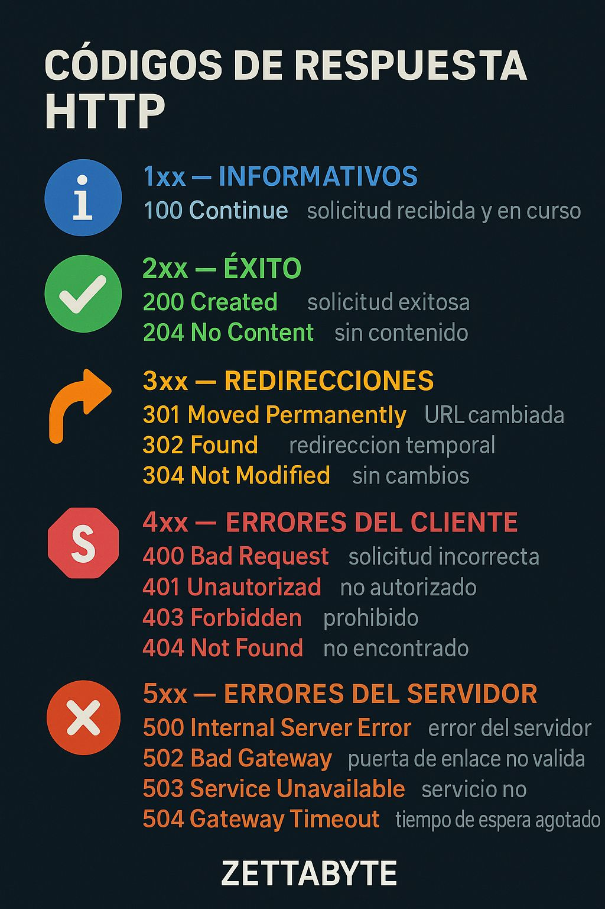

## 🌐 Códigos de Respuesta HTTP: La Guía que Todo IT Debería Dominar 🚀

Cada vez que haces una petición a un servidor, éste responde con un código HTTP.

 Saber interpretarlos es clave para depurar APIs, webs y microservicios.
Aquí tienes los más importantes, explicados de forma simple 👇

# ✅ 1xx — Informativos
El servidor recibió la petición y continúa procesándola.  
 🔹 100 Continue → Todo OK, sigue enviando datos.

# 🟩 2xx — Éxito
La operación se realizó correctamente.  
 🔹 200 OK → Todo salió bien.  
 🔹 201 Created → Recurso creado (muy común en APIs REST).  
 🔹 204 No Content → Petición correcta, sin contenido en la respuesta. 

# 🟧 3xx — Redirecciones
El cliente debe realizar otra acción para completar la petición.  
 🔹 301 Moved Permanently → La URL cambió para siempre.  
 🔹 302 Found → Redirección temporal.  
 🔹 304 Not Modified → El contenido no cambió (ahorra ancho de banda).  

# 🟥 4xx — Errores del Cliente
La petición está mal construida o no está autorizada.  
 🔹 400 Bad Request → La petición es inválida.  
 🔹 401 Unauthorized → Falta autenticación.  
 🔹 403 Forbidden → Autenticado, pero sin permisos.  
 🔹 404 Not Found → Recurso no encontrado (el más famoso).  
 🔹 429 Too Many Requests → Límite de peticiones excedido.  

# ⛔ 5xx — Errores del Servidor
El servidor falló al procesar la petición.  
 🔹 500 Internal Server Error → Error genérico del servidor.  
 🔹 502 Bad Gateway → Problema entre servidores intermedios.  
 🔹 503 Service Unavailable → Servicio inactivo o saturado.  
 🔹 504 Gateway Timeout → El servidor no respondió a tiempo.  

💬 Conocer estos códigos acelera el diagnóstico de errores y mejora el diseño de tus APIs.

