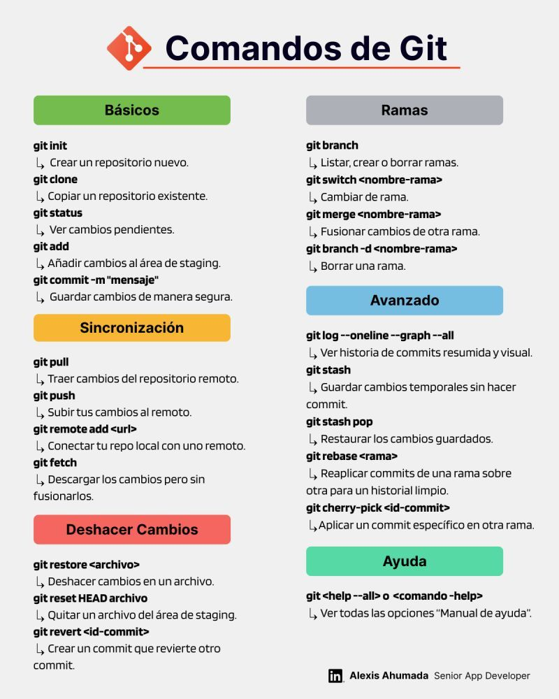

# 🧾 Lista de Comandos de Git Más Utilizados

Les comparto esta lista de comandos de **Git** que más suelo utilizar, todo en una misma hoja.

El objetivo es que, si apenas te estás adentrando al mundo del desarrollo o en el uso de sistemas de control de versiones como **Git**, tengas un listado de comandos con una pequeña explicación de qué realiza cada uno.

Usualmente esta lista se la comparto a los desarrolladores recién graduados o de nivel estudiante que se incorporan a mi equipo en la empresa donde trabajo. Aunque ya muchos o todos ellos conocen y utilizan Git, uno que otro comando no lo conocen y suele servirles para tener una referencia rápida y más herramientas a la hora de trabajar.

---

## 📌 Secciones

### 1️⃣ Comandos Básicos
| Comando | Descripción |
|----------|--------------|
| `git init` | Crear un repositorio nuevo. |
| `git clone <url>` | Copiar un repositorio remoto. |
| `git status` | Ver cambios pendientes. |
| `git add <archivo>` | Añadir cambios al área de *staging*. |
| `git commit -m "mensaje"` | Guardar cambios con una nota. |

---

### 2️⃣ Ramas y Fusión
| Comando | Descripción |
|----------|--------------|
| `git switch <rama>` | Cambiar de rama. |
| `git switch -c <nueva-rama>` | Crear y cambiar de rama. |
| `git merge <rama>` | Fusionar cambios de otra rama. |
| `git branch -d <rama>` | Borrar una rama local. |

---

### 3️⃣ Sincronización
| Comando | Descripción |
|----------|--------------|
| `git remote -v` | Ver repos remotos configurados. |
| `git fetch` | Descargar cambios sin fusionar. |
| `git pull` | Traer y fusionar en un solo paso. |
| `git push` | Subir tus *commits* al remoto. |

---

### 4️⃣ Git Avanzado
| Comando | Descripción |
|----------|--------------|
| `git stash` | Guardar cambios temporales sin *commit*. |
| `git stash pop` | Recuperar esos cambios. |
| `git rebase <rama>` | Reaplicar tus *commits* sobre otra rama. |
| `git log --oneline --graph --all` | Historial resumido y visual. |

---

### 5️⃣ Deshacer Cambios
| Comando | Descripción |
|----------|--------------|
| `git restore <archivo>` | Revertir cambios locales en un archivo. |
| `git reset --soft HEAD~1` | Deshacer último *commit* y mantener cambios. |
| `git reset --hard HEAD~1` | Deshacer *commit* y descartar cambios. |
| `git revert <id>` | Crear un *commit* inverso a uno anterior. |

---

### 6️⃣ Ayuda
| Comando | Descripción |
|----------|--------------|
| `git help` | Mostrar el manual de ayuda. |

---

💡 **Tip:** guarda esta lista como referencia rápida en tu entorno de trabajo o inclúyela en tu documentación interna.  
> “La práctica constante con estos comandos es la mejor forma de dominar Git.”